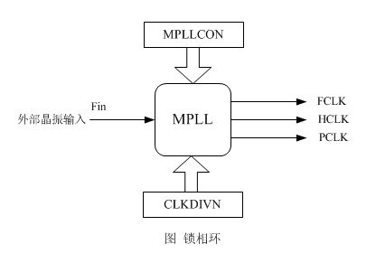
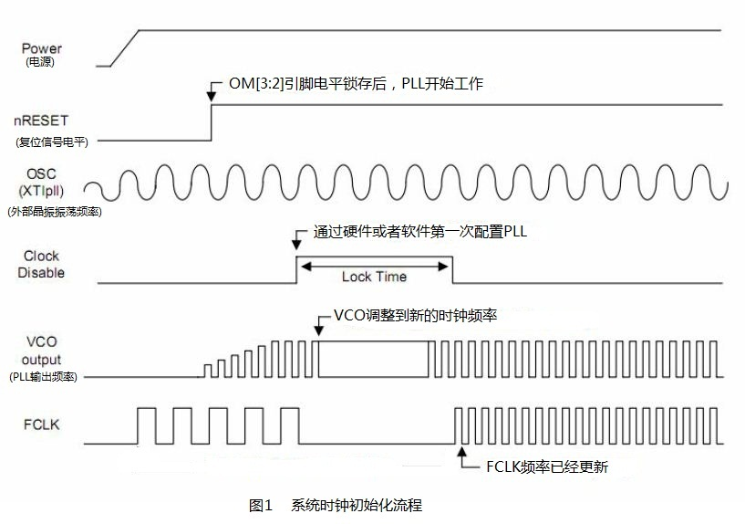

S3C2440系统时钟简介：
----
S3C2440的系统时钟分两个独立的源：主时钟源和USB时钟源，这两个时钟源可以通过引脚的设置OM[3:2]分别采用以下两种方式。

方式一，外接晶振，通过内部锁相环电路产生时钟源  
方式二，直接使用外部提供的时钟源

系统上电后，S3C2440处理器会自动锁存OM3和OM2引脚的电平值，这两个引脚用于选择外部时钟输入方式，如下表所示。你可以从我们的mini2440开发板的电路图看到，开发板上的OM3和OM2均接地，即OM[3:2]=00。所以，时钟源为外部晶振。  

参考

 - PAES
 - [一起学mini2440裸机开发(三)--S3C2440时钟学习](http://blog.csdn.net/mybelief321/article/details/8914299)
 - [关于arm时钟频率的设置及编程](http://blog.csdn.net/vanson18/article/details/6780674) - 基本概念介绍

mini2440对主时钟源和USB时钟源都采用的方式一。内部的锁相环电路分别为MPLL和UPLL，并可以使用独立的寄存器对这两个锁相环电路进行配置。

MPLL，主时钟锁相环电路，用于产生三种时钟信号

- FCLK, 给CPU内核提供时钟信号
- HCLK，为AHB外设提供时钟信号
- PCLK，为APB外设提供时钟信号

UPLL：USB时钟锁相环电路，用于产生供USB设备使用的时钟信号。

配置方法类似，以MPLL为主介绍。

系统时钟初始化流程
----

结合系统时钟初始化时序流程
开发板上电后，晶振OSC开始提供晶振时钟，由于系统刚刚上电，电压信号等都还不稳定，这时复位信号（nRESET）拉低。MPLL虽然默认启动，但是如果系统复位后不向MPLLCON中写入有效设置值，那么外部晶振产生的震荡信号将直接作为系统时钟FCLK（12MHZ）。过几毫秒后，复位信号上拉，CPU开始取指运行，这时可以通过代码设置MPLCON寄存器启动MPLL。

MPLL启动需要一定锁定时间（LockTime），这是因为MPLL输出频率还没有稳定，在软件上只要我们一设置MPLLCON之后，即图上所标识的“PLL is configured by S/W first time”, LockTime就被自动插入，在这期间FCLK都停止输出，CPU停止工作，过了LockTime后时钟稳定输出，CPU工作在新设置的频率FCLK下。

设置成功后系统使用由MPLL对12MHZ的晶振产生的震荡信号倍频后的输出作为FCLK。

- 1) LOCKTIME:设置LockTime变频锁定时间,LockTime变频锁定的时间长度由LOCKTIME寄存器来设置，由于变频后开发板所有依赖时钟工作的硬件都需要一小段调整时间，该时间计数通过设置LOCKTIME寄存器[31:16]来设置UPLL（USB时钟锁相环）调整时间，通过设置LOCKTIME寄存器 [15:0]设置MPLL调整时间，这两个调整时间数值一般用其默认值即可。  
- 2) MPLLCON(UPLLCON)：MPLL的主要功能就是对晶振的输入Fin进行倍频，需要设置FCLK与晶振输入频率（Fin）的倍数。  
- 3) CLKDIVN: 设置FCLK，HCLK，PCLK三者之间的比例

注：对CLKDIVN设置分频后的补充设置，如果CLKDIVN寄存器中的HDIVN标志位非0，需要将CPU的总线模式从"fast bus mode"改为"asynchronous bus mode"。参考S3C2440 UM Page7-9

		;当HDIVN==0的时候,FCLK:HCLK:PCLK=1：1：1,此时CPU的主频和快速总线时钟频率
		;一致，此时总线模式为“快速总线模式”。如果不是这个比例，或者说HDIVN!=0的时候，
		;这个时候我们总线上的频率和CPU的频率就不一样了，所以我们要把总线模式改为异步
		;总线模式。（S3C2440不支持同步总线模式）
		;MRC和MCR是协处理器相关命令
		mrc	p15, 0, r0, c1, c0, 0	;读出控制寄存器
		orr	r0, r0, #0xC0000000		;设置asynchronous bus mode
    	mcr	p15, 0, r1, c1, c0, 0	;写入控制寄存器

