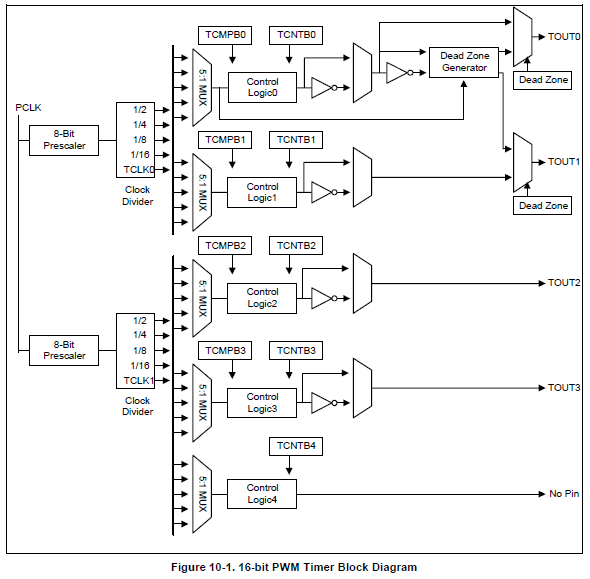

参考
----
[s3c2440的pwm输出](http://blog.csdn.net/hlyfx/article/details/8651916)  
[mini2440的PWM实验](http://hi.baidu.com/qq453158783/item/82f9a39e7e8f05d71f42710f)  
[PWM死区(Dead Zone)的作用和意义](http://blog.sina.com.cn/s/blog_944790400101f8ej.html)  
[让mini2440从GPB1输出PWM](http://blog.csdn.net/thinking811/article/details/7072081)  
[基于ARM的有制动不可逆PWM驱动电路的分析与设计](http://wenku.baidu.com/view/ea3c0bd176eeaeaad1f330c6.html)

PWM - Pulse Width Modulation [脉冲宽度调制](http://www.baike.com/wiki/脉宽调制)  
----
通过高分辨率计数器的使用，方波的占空比被调制用来对一个具体模拟信号的电平进行编码。PWM信号仍然是数字的，因为在给定的任何时刻，满幅值的直流供电要么完全有(ON)，要么完全无(OFF)。电压或电流源是以一种通(ON)或断(OFF)的重复脉冲序列被加到模拟负载上去的。通的时候即是直流供电被加到负载上的时候，断的时候即是供电被断开的时候。只要带宽足够，任何模拟值都可以使用PWM进行编码。

我的理解：如果是采用模拟信号，横轴为时间，纵轴为模拟信号量值，则变化是一个曲线，假设量值为1，则信号是一个从-1到1之间的变化量。不考虑方向（正负），则信号量变化是一个[0,1]之间的值  
采用PWM，就是利用占空比的值来等价这个[0,1]之间的值。  
而占空比可以用数字信号来模拟得到，接通（t）和周期T之间的比值t/T,参考http://baike.baidu.com/view/201672.htm

PWM定时器结构图
----

注：MUX:在电子技术中，数据选择器，或称多路复用器，是一种可以从多个输入信号中选择一个信号进行输出的器件。

从图上我们需要了解到：

1 S3C2440有5个16位的定时器，其中0,1,2,3定时器都有一个输出引脚，通过定时器控制引脚周期性的输出高低电平(通过引进GPB0~GPB3输出，这是GPB引脚的第三功能)，从而实现pwm功能。4号定时器没有输出引脚。

2 定时器的时钟源是PCLK，太高，要经过两次分频降低其频率

- 第一级是8位预分频（0~255），第一级预分频器有两个，定时器0和1共用一个，2，3，4共用一个。
- 第二级是4位分频，可以输出5种频率的时钟，2分频，4分频，8分频，16分频或者外部时钟TCLK0和TCLK1。
- 定时器的时钟频率=PCLK/(预分频值+1)/(分频值)，预分频值prescaler和分频值mux在寄存器TCFG0和TCFG1中设置。

3 除了确定定时器的工作频率，要了解定时器的工作原理，还需要了解定时器内部结构和控制逻辑如下:  

- (1) 初始化阶段，设定TCMPBn和TCNTBn两个寄存器，表示定时器n的比较值和初始计数值。
- (2) 设置TCON寄存器启动定时器n，这时TCMPBn和TCNTBn的值将被装载入其内部对应的寄存器TCMPn和TCNTn中。在定时器n的工作频率下，TCNTn开始减一，其值可以通过读取TCNTOn得到。
- (3) 当TCNTn的值和TCMPn的值相同时，定时器n会在输出引脚TOUTn输出一个电平反转，然后TCNTn继续减1，直至为0，再发生一次反转并在引脚输出一个反转电平，这样就实现了高低电平的反转，减为0时会触发中断（如果中断使能了的话）。
- (4) 在TCNTn的值变为0时，如果TCON寄存器中将定时器n设置为“自动加载”，则再次将TCMPBn和TCNTBn的值装载入其内部对应的寄存器TCMPn和TCNTn中。下一个计数流程开始。

总结有关PWM定时器设置的寄存器的用法：  
----
- 1）TCFG0： 设置一级预分频器
- 2）TCFG1： 设置二级分频
- 3）TCNTBn/TCMPBn：设置脉冲的具体宽度，前者可以确定一个计数周期的时间长度，而后者可以确定方波的占空比。由于s3c2440的定时器具有双缓存，因此可以在定时器运行的状态下，改变这两个寄存器的值，它会在下个周期开始有效。譬如需要led灯每隔0.5s闪烁一次，假设比较值为0 ，则需要每隔0.5秒输出引脚反转一次，则方波周期t=1s，而定时器分频后频率为1Mhz，就是说计数到1M/2个数后电平反转一次，所以应该TCNTBn=1M, TCMPBn=1M/2。
- 4）TCON (Timer Control): 有以下作用：
 - 第一次启动定时器时，“手动”将TCNTBn/TCMPBn装载入内部的TCNTn/TCMPn。
 - 启动，停止定时器
 - 决定在TCNT到达0时是否自动装载TCNTBn/TCMPBn
 - 决定TOUTn的初始状态（是高电平还是低电平),即决定了起始输出为高电平还是低电平。
- 5）TCNTOn（Count Observation）：查看内部TCNTn的值

