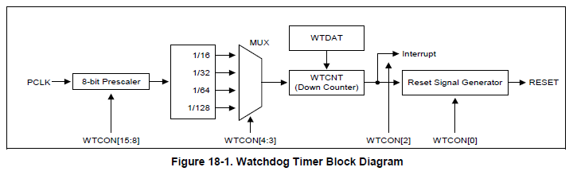

内部结构和逻辑
----

看门狗定时器内部有一个递减计数器WTCNT，WTCNT按照其工作频率减一计数，当该计数器递减为0的时候，就会产生中断信号，向CPU的复位管脚输出复位信号，自动重启CPU。如果我们写有这样的程序，该程序在定时器计数器递减为0之前，将其递减计数器重新设置一下（喂狗），那么就不会产生重启操作。假如机器设备出现异常情况下如死机，CPU执行出错，程序跑飞等情况，CPU就会陷入非正常的执行流程，就不会去执行重置计数器的程序，当计数器递减为0时，会产生复位控制器信号，机器就会重新启动，恢复正常执行流程。这样的设计原理就解决了很多环境恶劣的情况下，对服务器进行重启的任务。上面的重置倒计数的操作通常叫做“喂狗”。

涉及寄存器
----
1) WTCON: (Watchdog Timer CONtrol),用于设置预分频系数，二级分频系数，确定是否使能中断，是否启用Watchdog功能（输出复位信号）。watchdog定时器的工作频率计算公式和PWM相似。

2）WTDAT：（Watchdog Timer DATa）:决定定时器的超时周期，定时器启动后，计数达到0时，WTDAT的值会自动传入WTCNT，不过第一次启动时，需要手动往WTCNT中写入初始值。

3) WTCNT: (Watchdog Timer CouNT): 当计数值达到0时，如果中断被使能则发出中断，如果Watchdog功能被使能则发出复位信号。
