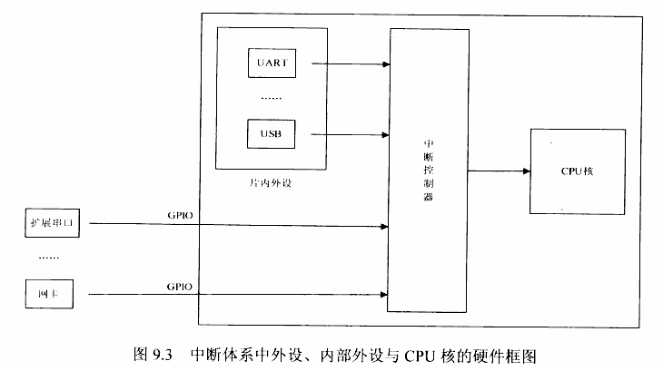
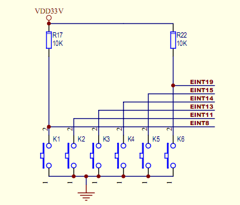

[ARM920T中断控制系统](http://blog.csdn.net/jinzheng_2010/article/details/6552029)

#中断控制机制
----
CPU运行过程中，如何知道各类外设发生了某些不预期的事件，比如串口收到了数据、按键被按下？
此时ARM有两种中断机制：

1.查询方式。程序不断地查询各设备的状态，并作出相应的反应。该方式实现比较简单，常用在比较单一的系统中，比如一个温控系统中可以使用查询方式不断检测温度的变化。特点：实现简单；但CPU利用率很低，不适合多任务的系统。

2.中断方式。当事件发生时，硬件会设置某个寄存器；CPU在执行完一个指令时，查看这个寄存器，如果所关注的事件发生了，则中断当前程序，跳转到一个固定的地址处理这个事件，处理完后返回到被终端的程序中继续运行。特点：实现相对复杂，但效率较高，是常用的方法。

#中断处理流程
----

1.中断控制器汇集各类外设发出的中断信号，然后通知CPU。  
2.CPU保存当前程序的运行环境，然后调用中断服务程序(ISR)来处理中断。  
3.在ISR中通过读取外设的相关寄存器来识别终端的类型，并进行相应的处理。  
4.清除中断。通过读写相关中断控制寄存器和外设相关寄存器来实现。  
5.恢复被中断程序的执行环境，继续执行被中断的程序。

#中断信号和中断源
----
S3C2440可以最多接受来自60个中断源，但对CPU核心来说同时最多只能有32路输入信号，这是因为有部分中断源是复用的。在32路输入信号中，有23路唯一对应一个中断源，其余9路信号（标红色）是复用的。  

##中断源和子中断源
S3C2440将中断源分为两级：中断源和子中断源，中断源里包含单一中断源和复合中断源，复合中断源是子中断源的复合信号。

以实时时钟中断为例，该硬件只会产生一种中断，它是单一中断源，直接将其中断信号线连接到中断源寄存器上。

对于复合中断源，以UART串口为例进行说明，S3C2440A可以支持3个UART串口，每个串口对应一个复合中断源信号 INT_UARTn，每个串口可以产生三种中断，也就是三个子中断：接收数据中断INT_RXDn，发送数据中断INT_TXDn，数据错误中断INT_ERRn，这三个子中断信号在中断源寄存器复合为一个中断信号，三种中断任何一个产生都会将中断信号传递给对应的中断源INT_UARTn，然后通过中断信号线传递给ARM内核。

##源和子源的列表：

 

##外部中断源和内部中断源
中断信号除上述分法之外，还可以按照硬件位置分为：外部中断源和内部中断源。

- **内部中断源**：它是嵌入式系统中常见硬件产生的中断信号，比如：UART串口中断源，时钟Timer中断源，看门狗中断源等
- **外部中断源**：有时嵌入式系统里要在外部接口上挂载一些外部设备，这些设备并不是一个通用嵌入式系统里必备硬件，比如：蓝牙模块，各种传感器，WIFI无线通信模块，这些硬件也要产生中断让CPU来处理数据，因此这些外设硬件通过中断信号线连接到中断控制器上，它们产生的中断叫做外部中断信号。它们有着和内部中断一样的处理机制，只不过，它没有一个固定的中断号与之对应，硬件与嵌入式系统的连接方式与中断处理完全由系统硬件与软件设计者实现。  
外设硬件通过输入输出接口I/O Ports挂接到嵌入式系统上，I/O Ports向外设提供外部中断信号线，输出电源，频率时钟和输入输出信号线，外部硬件根据自己需要连接到I/O Ports上，产生中断时向外部中断信号线上送出中断信号，通过外部中断信号线传递到中断控制器。
按键Key可以认为最为简单的一种硬件设备了，如下图所示：

它功能很简单，可以将电路接通，按键K1~K6一端接地为低电平，另外一端接电源正极为高电平，EINT8，EINT11，EINT13，EINT14，EINT15，EINT19六根中断信号线分别和高电平端按键相连，当按键按下时电路接通，整个电路变成低电平，中断信号线上电压产生变化，通过设置中断触发方式，产生外部中断请求，输入到CPU内部，从而实现按键中断控制。

S3C2440A可以支持EINT0~EINT23共24种外部中断，完全可以满足小型嵌入式设备外设硬件的需求。
外部中断源也分为外部中断源和外部子中断源，其处理方式和内部中断源基本一样。

#中断处理流程图及相关寄存器
----
  

一个更清晰的流程处理图：
 
第一步：**SRCPND**标记着32路信号的发生状态，注意是32路信号，不是60个中断源的发生状态。中断源是如何被映射到信号山去的呢？

- 对于独立中断源，不需要经过特别处理过程，所以如果发生，直接反映在SRCPND的对应位上。
- 而对于复用的中断源，一旦发生首先记录发生状态在EINTPND/SUBSRCPND，然后CPU根据对应掩码EINTMASK/INTSUBMASK的设置将允许服务的中断源映射到SRCPND的对应位上    

第二步：根据**INTMASK** 对32路信号的掩码设置可以屏蔽**SRCPND**中的某些路信号。  

第三步：**INTMOD**是对32路信号的模式设置，即认为标记哪些信号通路是IRQ，哪些是FIQ。（注：最多只能设置一路FIQ）。根据INTMOD的设置，
  
- 如果某路信号被标记为IRQ并且未被**INTMASK**屏蔽，则进入仲裁阶段，转第四步。
- 如果某路是FIQ并且发生了则直接通知系统。

第四步：根据**PRIORITY**寄存器的设置对同时发生的IRQ进行优先级仲裁，即如果多路IRQ发生则最终CPU只会挑出一路IRQ通知给系统，经过中断优先级仲裁器选出优先级最高的IRQ中断后，这个中断在**INTPND**寄存器中的相应位被置1，如前所述，CPU在执行完每条指令后可以检查该寄存器，如果上面有IRQ发生，则进入IRQ中断模式处理它。同一时间内，此寄存器只有一位被置1，在ISR中可以根据这个位确定中断类型。清除该中断时，往这个位写入0。 

- INTOFFSET
- EXTINT0~EXTINT2:24个外部中断分为三组，用这三个寄存器分别用于配置外部中断的触发方式(高电平，低电平，上升沿，下降沿，上升下降均可)。

##相关寄存器的清理
- 在IRQ中断服务程序中需要清理的寄存器包括**SRCPND**和**INTPND**的对应位。
- 在FIQ中断服务程序中不需要清理INTPND，但需要清理**SRCPND**。

#优先级仲裁
----
S3C2440A支持60种中断，多个硬件可能同时产生中断请求，由于CPU只能处理一个中断，中断控制器怎么选择出一个最佳的中断，交给ARM内核进行处理呢？ 中断控制器采用优先级仲裁比较的方式进行选择，找出优先级最高的中断源。中断控制器将60种中断源分成7组，如下图所示，它类似体育赛事里的比赛方式，所有参赛选手在小组赛PK，选择出小组赛最优秀选手，然后进入决赛阶段和其它小组最优先选择再PK，最后优胜者就是总冠军。其中ARBITER0~ARBITER5为“小组赛”阶段，中断源信号在各自小组里进行优先级仲裁，选择出最高优先级中断信号，每小组选出的中断信号送到ARBITER6，也就是决赛阶段，选择出最高优先级中断信号，交给ARM内核。

 
     