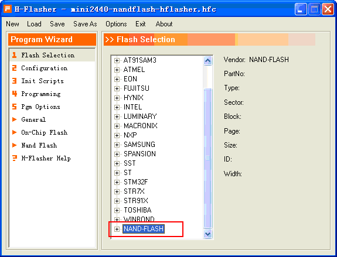

使用HJTAG对mini2440的nandflash进行烧写和擦除
----
参考  
1）"mini2440用户手册.pdf"的附录 - “使用 H-JTAG 快速烧写BIOS 到开发板”，2. 2 安装并设置H-JTAG。  
2）[H-Jtag V1.0 烧写Nand Flash](http://blog.csdn.net/dearwind153/article/details/7184224)  
3）[H-Jtag V1.0 烧写NOR Flash](http://blog.csdn.net/dearwind153/article/details/7183107)  
4）[基于mini2440的H-JTAG烧写程序的方法](http://wenku.baidu.com/view/c1fc762cb4daa58da0114ae7.html)  

探测ARM芯片
----
参考[H-Jtag V1.0 烧写NOR Flash](http://blog.csdn.net/dearwind153/article/details/7183107)  

烧写NOR Flash
----
步骤基本同[H-Jtag V1.0 烧写NOR Flash](http://blog.csdn.net/dearwind153/article/details/7183107)，唯一的是需要选择 mini2440_NOR_SST39VF1601.hfc，同时注意也会出现Flash id does not match的问题，一样解决即可。

烧写Nand Flash
----
（1）选择NOR方式启动，打开H-JTAG连接上ARM920T

（2）Flasher->Start H-Flasher

（3）打开Flash-Selection界面，设置初始化脚本，点击菜单的“Load”项，选择hfc文件。hfc文件需要匹配板子的nandflash的类型。因为我的板子的nandflash类型是SAMSUNG K9F2G08U0B，所以需要使用对应的hfc文件：mini2440_NAND_k9f2G08.hfc  
注：使用AXD连接HJTAG时也需要配置，参考手册“4.2 使用HJTAG进行代码调试”。

加载成功后，在chipset列表的最下面有一个NAND-FLASH选项。

点开后会看到我的mini2440对应的Nandflash的型号：SAMSUNG K9F2G08U0B

（4）进入Configuration设置好RAM的Start Address（0x30000000）,否则在对nandflash操作时会报如下错误：

（5）进入Progarmming界面，点击Check；如果想擦除NAND Flash 可以点击“Erase”

