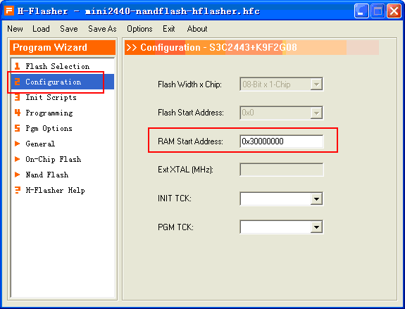

使用HJTAG对mini2440的nandflash进行烧写和擦除
----
参考 [H-Jtag V1.0 烧写Nand Flash](http://blog.csdn.net/dearwind153/article/details/7184224)

（1）选择NOR方式启动，打开H-JTAG连接上ARM920T

（2）Flasher->Start H-Flasher

（3）打开Flash-Selection界面，在chipset列表的最下面有一个NAND-FLASH选项。

点开后会看到我的mini2440对应的Nandflash的型号：SAMSUNG K9F2G08U0B

（4）进入Configuration设置好RAM的Start Address（0x30000000）,否则在对nandflash操作时会报如下错误：

（5）进入Progarmming界面，点击Check；如果想擦除NAND Flash 可以点击“Erase”

