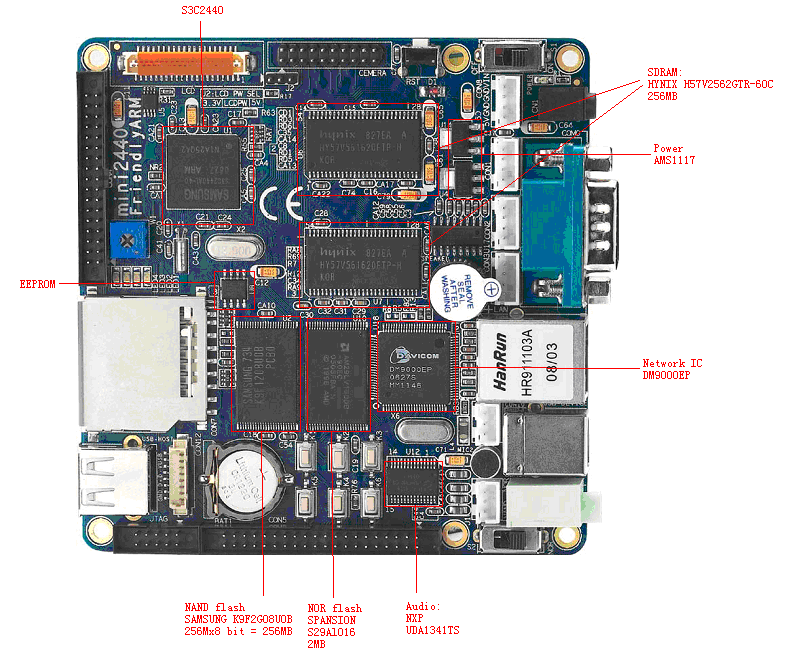

mini2440的硬件组成
----

SDRAM:
HYNIX H57V2562GTR-60C
256MB * 2

NAND flash
SAMSUNG K9F2G08U0B
256Mx8 bit = 256MB * 1

NOR flash
SPANSION S29Al016
2MB * 1
[ref](http://blog.csdn.net/yuesichiu/article/details/8267015)

Network IC
DM9000EP

Audio:
NXP UDA1341TS

Power
AMS1117

